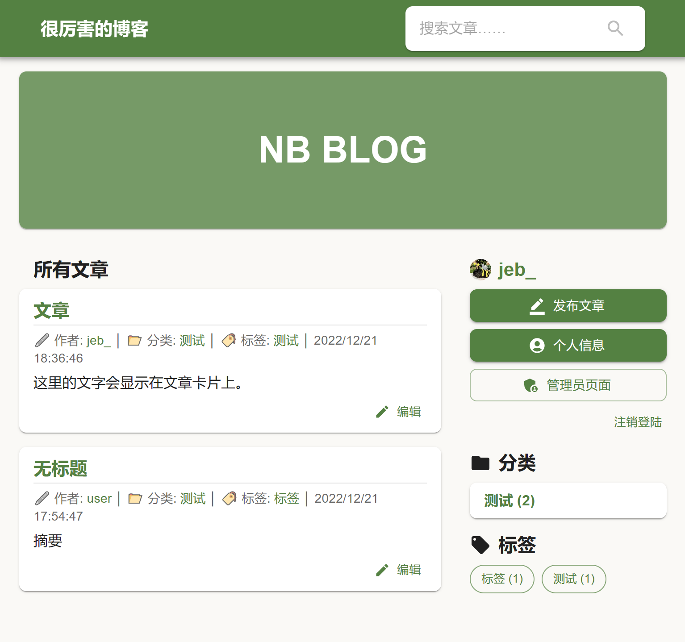
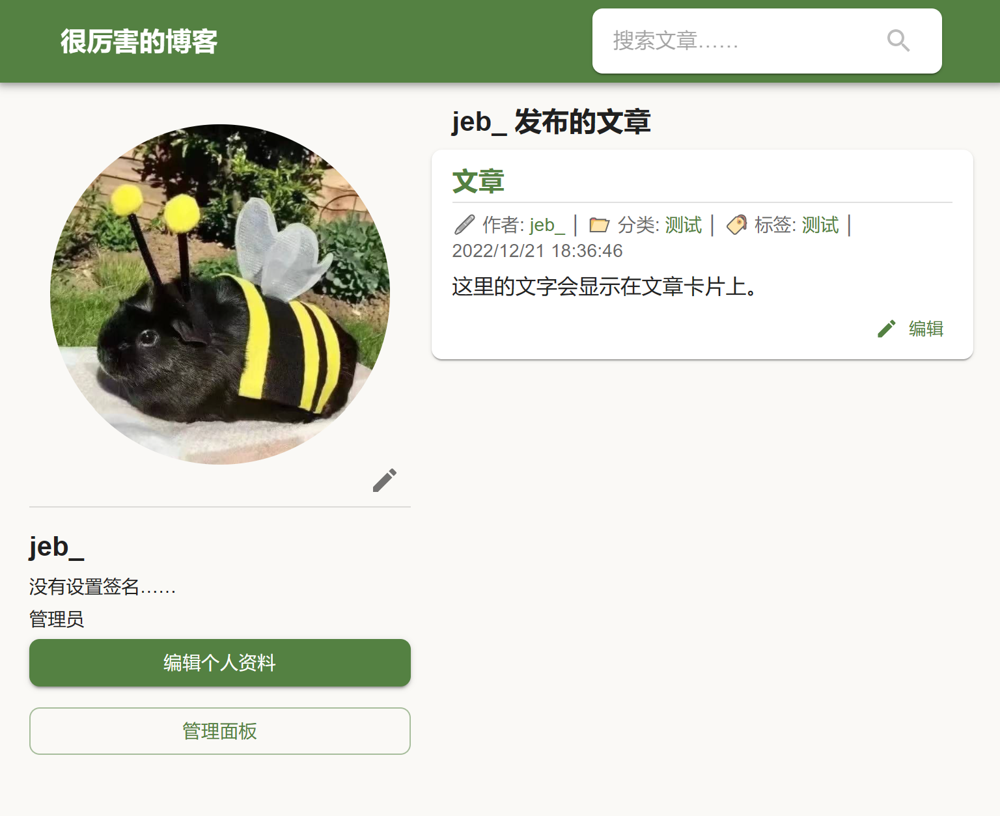
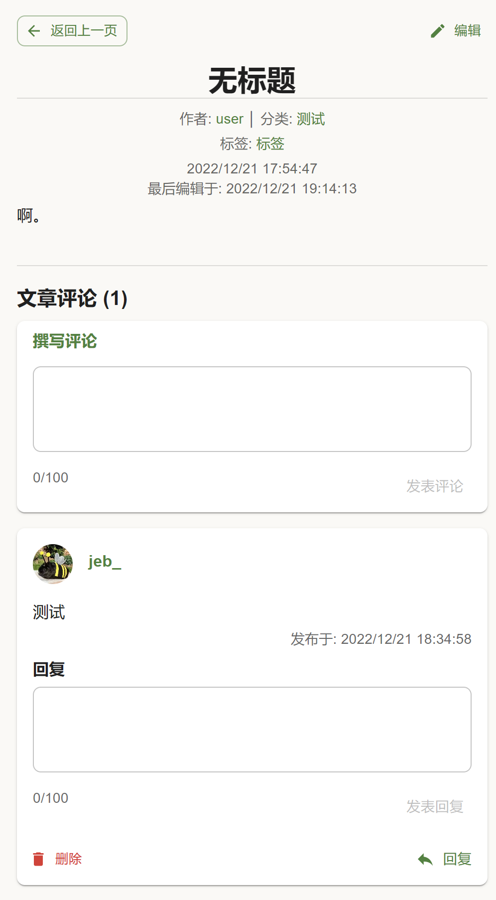
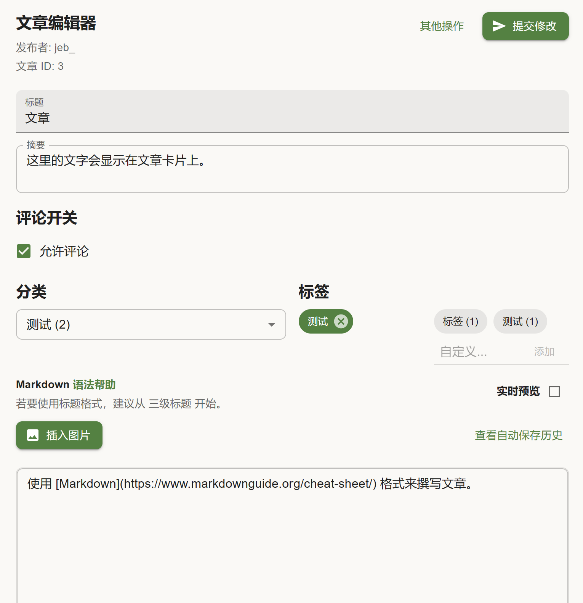
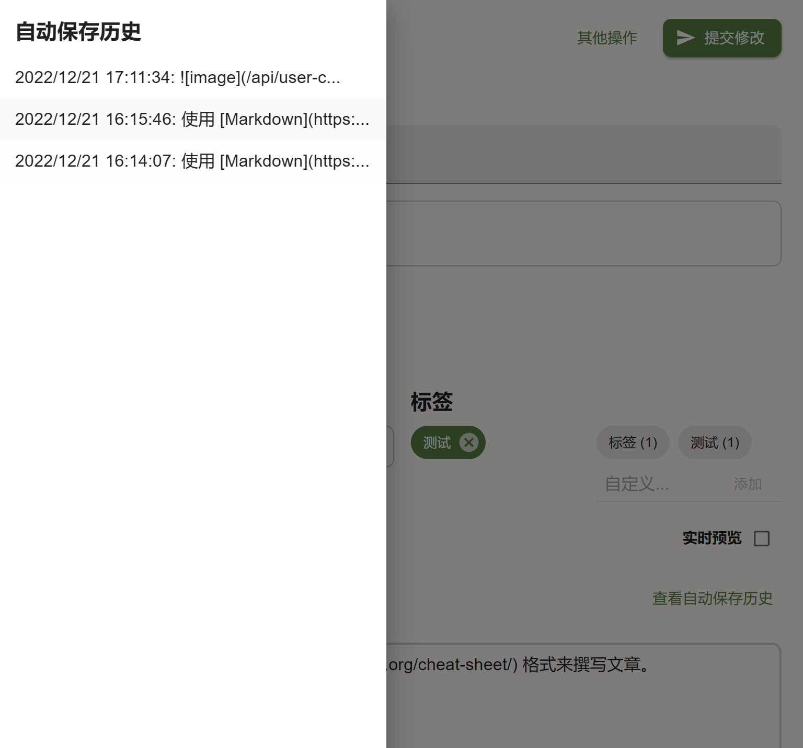

simple-blog-react
-----

### 简介

简单的一个博客前端。

你可以在 [这里](https://github.com/MossTheFox/simple-blog-backend) 找到示例后端程序 (Node.js)，或者按照 ```/src/scripts/``` 中提供的 ```*.template``` 文件所描述的接口，搭建一个后端、并在完成适配。

设计和制作得很草率。

### 截图







### License

MIT.